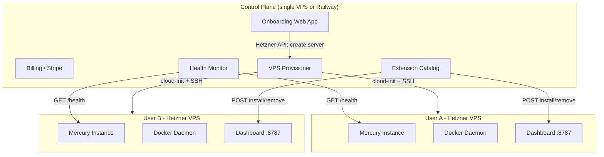
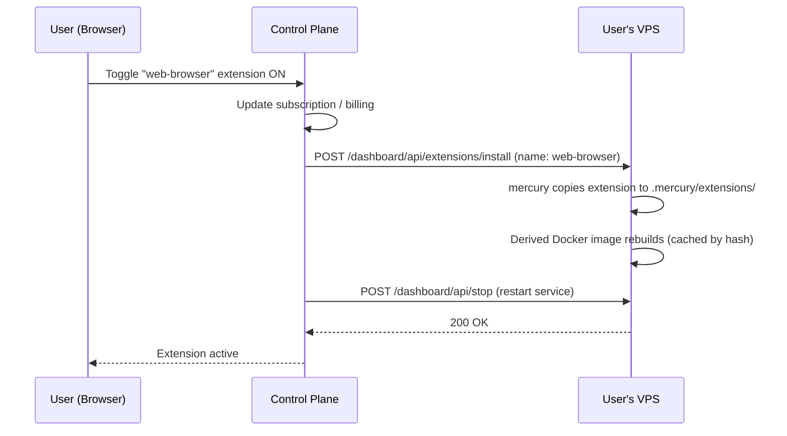
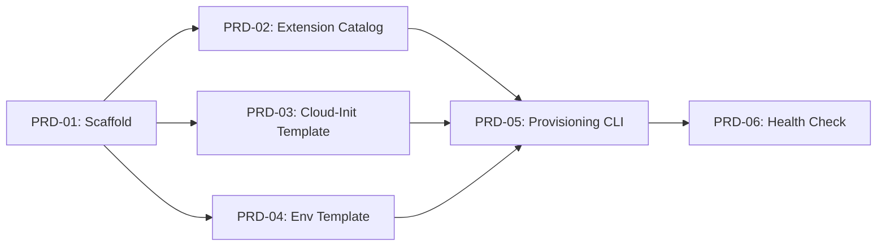


# Mercury Multi-User Platform -- Master Plan

## Development Methodology

This project follows the **plan-heavy, execute-light** workflow from [claude-for-engineers](https://github.com/kotevcode/claude-for-engineers):

```
/plan  --->  /prd  --->  /execute  --->  /retro
 Talk         Spec        Build           Learn
```

- **This document** is the `/plan` output -- the Master Plan capturing architecture, decisions, and constraints from collaborative exploration.
- **PRDs** are generated from this plan as detailed specs with exact file changes, acceptance criteria, and dependency ordering.
- **Execution** follows PRDs mechanically -- small tasks, no creative decisions by the agent.
- **Retro** after each phase captures what the PRDs got wrong and feeds improvements back.

---

## Skills and Rules to Create

Before writing PRDs, we need Cursor skills and rules that enforce the methodology in every session.

### Rules (`.cursor/rules/`)

**1. `cloud-console-workflow.mdc`** -- always-applied when working on `mercury-cloud-console/`

```yaml
---
description: Enforces the /plan -> /prd -> /execute -> /retro workflow for mercury-cloud-console
globs: mercury-cloud-console/**
alwaysApply: false
---
```

Content:

- Never start coding without an approved PRD
- PRDs live in `mercury-cloud-console/prds/<phase>/`
- Each PRD task must specify CREATE/MODIFY/DELETE with exact file path
- After execution, update the PRD with an execution log (timestamp, files touched, issues)
- If something deviates from the PRD during execution, stop and flag it -- do not improvise

**2. `prd-format.mdc`** -- applied when editing PRD files

```yaml
---
description: PRD file format specification for the /plan -> /prd -> /execute -> /retro workflow
globs: "**/prds/**/*.md"
alwaysApply: false
---
```

Content: The PRD format spec (see "PRD File Format" section below)

### Skills (`.cursor/skills/`)

**3. `prd-write/SKILL.md`** -- triggered when writing or updating PRDs

```yaml
---
name: prd-write
description: >-
  Write detailed PRDs with exact file changes, acceptance criteria, and dependency ordering.
  Use when creating PRD documents, specifying technical tasks, or breaking features into
  mechanical implementation steps.
---
```

Content:

- Read the Master Plan at `mercury-cloud-console/prds/master-plan.md` for context
- Follow the PRD format from `prd-format.mdc`
- Break every task to the smallest mechanical step (even "add this import" level)
- Each task must have: file operation (CREATE/MODIFY/DELETE), exact path, code or description, acceptance criteria
- Never leave creative decisions for the executor -- specify everything

**4. `prd-execute/SKILL.md`** -- triggered when implementing from PRDs

```yaml
---
name: prd-execute
description: >-
  Execute PRD tasks mechanically with no creative decisions. Use when implementing tasks
  from an approved PRD, following exact file change specifications, or building features
  that have been pre-specified.
---
```

Content:

- Read the PRD file first -- it is the source of truth
- Execute tasks in order, respecting dependencies
- After each task, update the PRD execution log with timestamp and files touched
- If a task is ambiguous or doesn't match reality, STOP and flag -- do not improvise
- Run acceptance criteria checks after each task

**5. `retro/SKILL.md`** -- triggered when reviewing completed work

```yaml
---
name: retro
description: >-
  Conduct a retrospective after executing PRDs. Use when a phase is complete, after testing
  deployed changes, or when reviewing what went right and wrong in an implementation cycle.
---
```

Content:

- Compare PRD specs vs actual implementation -- what deviated?
- Capture: what worked, what didn't, what the PRDs got wrong, surprises
- Output a `retrospective.md` in the phase's PRD directory
- If new "gotchas" were discovered, update project rules (`AGENTS.md`, `.cursor/rules/`)
- Feed learnings into the Master Plan for future phases

---

## PRD File Format

Every PRD follows this structure:

```markdown
---
prd: "01"
title: "Project Scaffold"
phase: 1
depends_on: []
estimated_effort: "2 hours"
status: draft | approved | in-progress | done
---

# PRD-01: Project Scaffold

## Overview
One paragraph: what this PRD accomplishes and why.

## Tasks

### Task 1: [Short description]
##### CREATE: path/to/file.ts
[Exact file contents or detailed specification]

**Acceptance:** [How to verify this task is done correctly]

### Task 2: [Short description]
##### MODIFY: path/to/existing-file.ts
**Add** (after existing import block):
[Exact code to add]

**Acceptance:** [Verification step]

### Task 3: [Short description]
##### DELETE: path/to/old-file.ts
**Reason:** [Why this file is being removed]

## Execution Log
| Task | Status | Timestamp | Files Touched | Notes |
|------|--------|-----------|---------------|-------|
| 1    |        |           |               |       |
| 2    |        |           |               |       |

## Acceptance Criteria
- [ ] [Overall PRD acceptance check 1]
- [ ] [Overall PRD acceptance check 2]
```

---

## PRD Hierarchy and Directory Structure

```
mercury-cloud-console/
└── prds/
    ├── master-plan.md                              # Main PRD -- this document (architecture + PRD index + timeline)
    ├── phase-1_manual-onboarding/
    │   ├── prd-01_project-scaffold.md
    │   ├── prd-02_extension-catalog.md
    │   ├── prd-03_cloud-init-template.md
    │   ├── prd-04_env-template.md
    │   ├── prd-05_provisioning-cli.md
    │   ├── prd-06_health-check.md
    │   └── retrospective.md                        # Written after Phase 1 execution
    ├── phase-2_control-plane/
    │   ├── prd-07_db-schema.md                     # Written after Phase 1 retro
    │   ├── prd-08_auth.md
    │   ├── prd-09_onboarding-wizard.md
    │   ├── prd-10_stripe-billing.md
    │   ├── prd-11_agent-client.md
    │   ├── prd-12_api-key-encryption.md
    │   └── retrospective.md
    └── phase-3_enhanced-experience/
        ├── prd-13_dashboard-enhancements.md        # Written after Phase 2 retro
        ├── prd-14_admin-skill.md
        ├── prd-15_usage-alerts.md
        └── retrospective.md
```

The **master-plan.md** (this document) is the main PRD. It contains:

- Architecture decisions and constraints (the "why")
- The PRD index with dependencies (the "what")
- The dev timeline (the "when")
- Links to all sub-PRDs

Sub-PRDs contain exact file changes -- the "how" at task level.

---

## Dev Timeline

Target: Phase 1 usable in ~2 weeks, Phase 2 in ~6 weeks, Phase 3 in ~10 weeks.

### Phase 1: Manual Onboarding (Weeks 1-2)


| PRD | Title               | Effort | Depends On | Target  |
| --- | ------------------- | ------ | ---------- | ------- |
| 01  | Project Scaffold    | 2h     | --         | Day 1   |
| 02  | Extension Catalog   | 3h     | 01         | Day 1-2 |
| 03  | Cloud-Init Template | 4h     | 01         | Day 2-3 |
| 04  | Env Template        | 2h     | 01         | Day 2   |
| 05  | Provisioning CLI    | 6h     | 02, 03, 04 | Day 3-5 |
| 06  | Health Check        | 2h     | 05         | Day 5   |
| --  | **Real VPS test**   | 4h     | 06         | Day 6-7 |
| --  | **Phase 1 Retro**   | 2h     | test       | Day 7   |


**Phase 1 total: ~~25 hours (~~1-2 weeks at part-time)**

### Phase 2: Control Plane Web App (Weeks 3-6)


| PRD | Title                | Effort | Depends On    | Target   |
| --- | -------------------- | ------ | ------------- | -------- |
| 07  | DB Schema            | 3h     | Phase 1 retro | Week 3   |
| 08  | Auth (NextAuth)      | 4h     | 07            | Week 3   |
| 09  | Onboarding Wizard    | 8h     | 07, 08        | Week 3-4 |
| 10  | Stripe Billing       | 6h     | 07, 08        | Week 4   |
| 11  | Agent Client         | 4h     | 07            | Week 4   |
| 12  | API Key Encryption   | 4h     | 07            | Week 4-5 |
| --  | **Integration test** | 6h     | all           | Week 5   |
| --  | **Phase 2 Retro**    | 2h     | test          | Week 6   |


**Phase 2 total: ~~37 hours (~~3-4 weeks at part-time)**

### Phase 3: Enhanced Experience (Weeks 7-10)


| PRD | Title                    | Effort | Depends On    | Target    |
| --- | ------------------------ | ------ | ------------- | --------- |
| 13  | Dashboard Enhancements   | 6h     | Phase 2 retro | Week 7-8  |
| 14  | Admin Skill              | 4h     | Phase 2       | Week 8    |
| 15  | Usage Alerts             | 3h     | 10, 11        | Week 9    |
| --  | **Beta test with users** | 8h     | all           | Week 9-10 |
| --  | **Phase 3 Retro**        | 2h     | test          | Week 10   |


**Phase 3 total: ~~23 hours (~~2-3 weeks at part-time)**

**Grand total: ~85 hours across ~10 weeks**

---

# Architecture

## The Hard Constraint: Mercury Needs Docker

Mercury's `container-runner.ts` spawns `docker run` processes for every message. This means the host **must** have a Docker daemon. This eliminates:

- **Vercel / Cloudflare Workers** -- serverless, no Docker, request timeouts
- **Pure container platforms** (Cloud Run, App Runner) -- no Docker-in-Docker
- **Shared hosting / Hostinger web hosting** -- no Docker

This leaves **VPS** or **VM-based** hosting as the only viable path.

---

## Recommended Architecture (for 1-20 users)




### Two components to build:

**1. Control Plane** (single deployment -- yours)

- User signup, onboarding wizard, Stripe billing
- Extension marketplace with pricing
- Provisions VPS instances via cloud API
- Monitors health of all user agents
- Can be a simple Next.js app on Railway/Vercel (no Docker needed here)

**2. Agent VPS** (one per user -- provisioned automatically)

- Mercury + Docker, running as systemd service
- User's selected extensions pre-installed
- Dashboard exposed on a subdomain (e.g. `alice.yourdomain.com`)
- `/health` endpoint for monitoring

---

## Hosting Provider Comparison

For the per-user VPS (the agents):

- **Hetzner Cloud** -- RECOMMENDED. CX22 (2 vCPU, 4GB RAM, 40GB SSD) at ~$4.50/mo. Excellent API for automated provisioning. EU + US datacenters. Best price/performance by far.
- **DigitalOcean Droplets** -- $6/mo for equivalent spec. Slightly better US presence. Mature API. Good alternative.
- **Vultr** -- Similar to DigitalOcean. $6/mo. Good API.
- **Hostinger VPS** -- Cheaper on paper (~$3-5/mo) but **poor API for automation**. Manual panel-oriented. Not suitable for automated provisioning.

**Recommendation: Hetzner Cloud.** At 20 users, you're looking at ~$90/mo in VPS costs. Their API (`hcloud`) is solid for automated provisioning.

For the control plane:

- **Railway** or **Fly.io** -- simple, no Docker needed, cheap for a single web app
- Or just another Hetzner VPS running the control plane

---

## Why NOT Kubernetes

For 1-20 users, Kubernetes adds massive operational overhead for zero benefit:

- You need to learn/manage K8s (or pay for managed K8s which starts at ~$70/mo just for the control plane on most providers)
- Mercury needs Docker access -- running DinD in K8s pods is a security and complexity nightmare
- Each user needs isolation (different API keys, different extensions, different state) -- separate VPS gives you this for free
- **Revisit K8s at 100+ users** when you need auto-scaling and want to consolidate VPS management

---

## Extension Provisioning Flow

When a user adds/removes an extension, it needs to be reflected on their running VPS:




Mercury **already** has `POST /dashboard/api/extensions/install` and `DELETE /dashboard/api/extensions/:name` endpoints. The extension catalog is also already in the dashboard. The control plane just needs to proxy these calls.

What needs to be built:

- A **management API** on each VPS (or reuse the existing dashboard API with auth) that the control plane can call
- A **restart trigger** after extension changes (the derived Docker image rebuilds automatically on next startup via `image-builder.ts`)
- The control plane stores which extensions each user has paid for

---

## User Control Interfaces (3 tiers)

### Tier 1: Onboarding Web App (control plane) -- BUILD THIS FIRST

- Signup with email/Google
- "Create your agent" wizard: pick a name, pick extensions, enter API keys
- Stripe checkout for selected plan
- After payment: VPS provisioned automatically, user gets a dashboard URL
- Extension marketplace: toggle capabilities on/off, see pricing

### Tier 2: Per-Agent Dashboard (already exists) -- ENHANCE

Mercury's existing dashboard at `/dashboard` already handles:

- Spaces, conversations, tasks, permissions, roles
- Extension install/remove (Features page)
- Usage/token tracking
- SSE live updates

Each user accesses their dashboard at `https://<username>.yourdomain.com`. Enhancements needed:

- Add billing/subscription info panel
- Add API key management (encrypted storage, not `.env`)
- Improve mobile responsiveness

### Tier 3: Chat-Based Management (via WhatsApp/Telegram) -- LATER

Since users already talk to their agent via messaging, admin commands are natural:

- "Show my usage this month" -- agent queries token_usage table
- "Enable web-browser" -- agent calls the control plane API
- "Pause all tasks" -- agent uses existing mrctl commands

This is essentially a new **admin skill** that the agent has. It could be an extension itself. This is the most "easy" interface but should come after tiers 1 and 2 are solid.

---

## VPS Provisioning Implementation

### Using Hetzner Cloud API + cloud-init:

1. Control plane calls `POST /v1/servers` with a cloud-init script
2. Cloud-init installs Docker, Bun, clones Mercury, writes `.env`, installs extensions, runs `mercury service install`
3. Control plane adds DNS record (`user.yourdomain.com` -> VPS IP)
4. Control plane polls `/health` until the agent is ready

The cloud-init script would be templated per user with their selected extensions, API keys (encrypted at rest in control plane DB, decrypted only for provisioning), and channel configs.

**Estimated provisioning time: 3-5 minutes** (VPS boot + Docker pull + Mercury start).

### For ongoing management (add/remove extensions):

- Control plane SSHs to the VPS or calls the Mercury dashboard API
- Runs `mercury add <extension>` / `mercury remove <extension>`
- Restarts the service via `mercury service install`

---

## Billing Model

- **Base plan**: Mercury agent on VPS (~$5-10/mo to user, covering VPS cost + margin)
- **Extensions**: Each priced individually (e.g. web-browser +$3/mo, PDF +$2/mo, napkin +$5/mo)
- **LLM usage**: Pass-through for BYOK; marked-up for platform-provided keys
- **Stripe** for subscriptions with metered billing for LLM usage

Mercury already tracks token usage in SQLite (`token_usage` table with cost, model, provider per space). The control plane can periodically pull this data from each VPS for billing.

---

## What to Build (Phased)

### Phase 1: Manual onboarding with automation scripts (weeks 1-3)

- Hetzner cloud-init script that bootstraps a Mercury VPS
- Simple provisioning CLI or script (not yet a web app)
- DNS setup (wildcard `*.agents.yourdomain.com`)
- Test with 2-3 beta users

### Phase 2: Control plane web app (weeks 4-8)

- Next.js onboarding app with Stripe
- Extension catalog with pricing
- VPS provisioning via Hetzner API
- Health monitoring dashboard
- Per-user encrypted API key storage

### Phase 3: Enhanced per-user experience (weeks 9-12)

- Mercury dashboard improvements (billing panel, API key management, mobile)
- Chat-based admin commands (admin skill/extension)
- Usage alerts and cost controls
- Extension marketplace for community extensions

---

## Repo Structure

```
mercury/
├── mercury-fork/                # Core Mercury framework (unchanged)
├── mercury-assistant/           # Your personal assistant instance (unchanged)
└── mercury-cloud-console/       # NEW -- Control plane + provisioning
    ├── package.json             # Next.js app dependencies
    ├── .env.example             # Hetzner API token, Stripe keys, DB URL, etc.
    ├── src/
    │   ├── app/                 # Next.js App Router pages
    │   │   ├── page.tsx             # Landing / marketing
    │   │   ├── signup/              # Signup flow
    │   │   ├── onboarding/          # Agent creation wizard
    │   │   ├── dashboard/           # User's control panel (extensions, billing, health)
    │   │   └── api/                 # API routes
    │   │       ├── provision/       # VPS create/destroy
    │   │       ├── extensions/      # Install/remove on user VPS
    │   │       ├── billing/         # Stripe webhooks
    │   │       └── health/          # Agent health polling
    │   ├── lib/
    │   │   ├── hetzner.ts           # Hetzner Cloud API client
    │   │   ├── stripe.ts            # Stripe billing logic
    │   │   ├── provisioner.ts       # VPS lifecycle (create, configure, destroy)
    │   │   ├── agent-client.ts      # HTTP client for Mercury dashboard API on user VPS
    │   │   ├── encryption.ts        # Envelope encryption for API keys
    │   │   └── db.ts                # Control plane DB (users, agents, subscriptions)
    │   └── catalog/
    │       └── extensions.yaml      # Extension catalog with pricing metadata
    ├── infra/
    │   ├── cloud-init.yaml.tmpl     # Cloud-init template for bootstrapping agent VPS
    │   ├── mercury.env.tmpl         # .env template rendered per user
    │   └── scripts/
    │       ├── provision.ts         # Standalone provisioning script (Phase 1 CLI)
    │       └── health-check.ts      # Batch health checker for all user agents
    └── README.md
```

Key separation:

- `mercury-fork/` stays pure -- it's the open-source framework, no SaaS concerns
- `mercury-assistant/` stays as your personal assistant instance
- `mercury-cloud-console/` is the SaaS layer: onboarding, billing, provisioning, monitoring

The control plane talks to user VPS instances via Mercury's existing HTTP API (`/dashboard/api/*`, `/health`). No changes to `mercury-fork/` are needed for Phase 1.

---

## Key Technical Decisions

- **Hetzner Cloud** for agent VPS hosting (cheapest, great API)
- **Railway or Vercel** for the control plane web app
- **Stripe** for billing
- **cloud-init + Hetzner API** for automated provisioning (no Ansible/Terraform needed at this scale)
- **Wildcard DNS** + Caddy/nginx reverse proxy OR per-VPS DNS for agent dashboards
- **No Kubernetes** until 100+ users
- **Existing Mercury dashboard** as the per-user management UI (don't rebuild)
- **Mercury's existing extension install/remove API** for the control plane to manage extensions remotely

---

## PRD Roadmap

PRDs are organized by phase. Each PRD has dependencies listed. Phase 2 PRDs will be written after Phase 1 retro (learnings from real deploys feed into the specs).

### Phase 1: Manual Onboarding with Automation Scripts

Goal: Provision a Mercury agent on a Hetzner VPS using a CLI script. No web UI yet. Test with 1-2 real users.




- **PRD-01: Project Scaffold** -- no dependencies
  - CREATE `mercury-cloud-console/package.json` (Bun project, dependencies: hcloud-js, dotenv, yaml)
  - CREATE `mercury-cloud-console/tsconfig.json`
  - CREATE `mercury-cloud-console/.env.example` (HETZNER_API_TOKEN, domain, SSH key)
  - CREATE `mercury-cloud-console/README.md`
  - CREATE folder structure: `src/catalog/`, `src/lib/`, `infra/`, `infra/scripts/`, `prds/`
  - Acceptance: `bun install` succeeds, `bun run typecheck` passes
- **PRD-02: Extension Catalog** -- depends on PRD-01
  - CREATE `mercury-cloud-console/src/catalog/extensions.yaml` listing all available extensions with: name, description, install source (npm/git/local), monthly price, required env vars, model capabilities needed
  - CREATE `mercury-cloud-console/src/lib/catalog.ts` loader that parses YAML, validates schema, exports typed catalog
  - Acceptance: catalog loads with no errors, lists at least 5 extensions from mercury-assistant examples
- **PRD-03: Cloud-Init Template** -- depends on PRD-01
  - CREATE `mercury-cloud-console/infra/cloud-init.yaml.tmpl` -- installs Docker, Bun, clones Mercury from npm, writes .env, installs selected extensions via `mercury add`, runs `mercury service install`, opens port 8787
  - CREATE `mercury-cloud-console/src/lib/cloud-init.ts` template renderer that substitutes user variables
  - Acceptance: rendered cloud-init is valid YAML, contains all required steps in correct order
- **PRD-04: Env Template** -- depends on PRD-01
  - CREATE `mercury-cloud-console/infra/mercury.env.tmpl` with all MERCURY_* variables, per-user placeholders for API keys, channel tokens, API secret
  - CREATE `mercury-cloud-console/src/lib/env-renderer.ts` that takes user config object and renders .env string
  - Acceptance: rendered .env passes Mercury's config.ts Zod validation when loaded
- **PRD-05: Provisioning CLI** -- depends on PRD-02, PRD-03, PRD-04
  - CREATE `mercury-cloud-console/infra/scripts/provision.ts` -- Bun CLI script that: reads user config from a JSON file, calls Hetzner API to create server with cloud-init, waits for server ready, adds DNS record (Hetzner DNS or Cloudflare), polls /health until 200, prints dashboard URL
  - CREATE `mercury-cloud-console/src/lib/hetzner.ts` -- typed Hetzner Cloud API client (create server, delete server, list servers, add SSH key)
  - Acceptance: can provision a real Hetzner VPS and get /health 200 within 5 minutes
- **PRD-06: Health Check Script** -- depends on PRD-05
  - CREATE `mercury-cloud-console/infra/scripts/health-check.ts` -- reads list of provisioned agents, calls /health on each, reports status
  - Acceptance: correctly reports healthy/unhealthy for running and stopped agents

### Phase 2: Control Plane Web App (PRDs written after Phase 1 retro)

Planned PRDs (details TBD based on Phase 1 learnings):

- **PRD-07: Control Plane DB Schema** -- Postgres/SQLite schema for users, agents, subscriptions, extension_activations
- **PRD-08: Auth** -- NextAuth.js signup/login with email + Google
- **PRD-09: Onboarding Wizard UI** -- step-by-step agent creation (name, extensions, API keys, channel config)
- **PRD-10: Stripe Billing** -- subscription plans, extension add-ons, metered LLM usage
- **PRD-11: Agent Client Library** -- HTTP client for calling Mercury API on remote VPS (health, extensions, usage)
- **PRD-12: API Key Encryption** -- envelope encryption for user secrets (KMS + AES)

### Phase 3: Enhanced Experience (PRDs written after Phase 2 retro)

- **PRD-13: Dashboard Enhancements** -- billing panel, API key management in Mercury dashboard
- **PRD-14: Admin Skill/Extension** -- chat-based management commands via WhatsApp/Telegram
- **PRD-15: Usage Alerts** -- cost controls and notifications

---

## Retro Checkpoints

After each phase, a retro captures:

- What the PRDs got right/wrong
- Provisioning time vs. estimate (target: under 5 min)
- Extension install reliability (did derived image build correctly?)
- Security gaps discovered
- User friction points from beta testers
- Updates to this Master Plan and `AGENTS.md` / project rules

Retros are saved to `mercury-cloud-console/prds/<timestamp>_phase-N/retrospective.md`.
